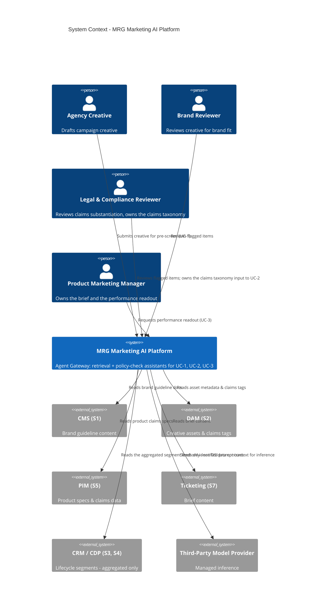

# MAWO — Marketing AI Workflow Orchestration

> **Fictional reference scenario authored as an architecture portfolio piece. Not a record of a client engagement.**
> This repository documents a fictional company ("Meridian Retail Group") and a fictional AI architecture engagement. No real client, vendor data, or proprietary material is used. Numbers are labeled `[illustrative]` or `[measured]` throughout.

## The fifteen-minute path

**The scenario, in three sentences:** Meridian Retail Group (MRG) is a fictional omnichannel retailer whose campaign content lifecycle — brief, creative, brand review, legal review, localization across four markets, activation, readout — takes about 23 business days `[illustrative]`, roughly 60% of it spent in queue rather than in work. This repository assesses that process, specifies where AI assistance genuinely helps and where it deliberately doesn't, and builds a small runnable slice to prove the specs are real. It is written as the portfolio artifact for an AI Solution Architect (Marketing/MarTech) role: the work here is to **assess, specify, validate, and govern** — not to ship the underlying model.

New to this and want the business framing before the architecture? Start with [`docs/00-executive-brief.md`](docs/00-executive-brief.md) — two pages, written for a CMO, no architecture jargon.

### The architecture, at a glance



Three AI use cases, each closing a specific bottleneck: **UC-1** claims & brand pre-screen, **UC-2** localization claims consistency, **UC-3** performance readout synthesis. The full container view, trust-boundary diagram, and AWS deployment view (with an Azure equivalence table) are in [`docs/04-target-architecture.md`](docs/04-target-architecture.md).

### If you only read four things

- **[`docs/02-bottleneck-register.md`](docs/02-bottleneck-register.md)** — where AI helps, and, just as deliberately, where it doesn't. Three rows score **None** for automation candidacy, with the reasoning spelled out.
- **[`docs/05-data-pipelines.md`](docs/05-data-pipelines.md)** — the gap-closer for "collaborate with Data Engineering to design data pipelines." Ingestion mode justified per source, real data contracts for the two highest-value feeds, and an explicit list of what was deliberately *not* pipelined.
- **[`docs/08-vendor-evaluation.md`](docs/08-vendor-evaluation.md)** — one weighted rubric, three use cases, and it doesn't come back the same answer every time: two Build verdicts and one Buy verdict, plus a TCO model where the recommendation isn't cheapest at every scale.
- **[`docs/09-platform-roadmap-ask.md`](docs/09-platform-roadmap-ask.md)** — the gap-closer for "influence platform roadmaps." Four capability gaps this project worked around rather than solved, written as an investment pitch to a platform-engineering org that owns its own roadmap.

The full deliverable list — eleven documents, an OpenAPI spec, two data contracts, twelve ADRs — is in [`PROJECT_PLAN.md`](PROJECT_PLAN.md).

### Running the reference slice

```bash
cd reference-slice
docker compose up
```

No API keys required — it defaults to a deterministic mock provider. Then:

```bash
curl -X POST http://localhost:8000/v1/invoke \
  -H "Content-Type: application/json" \
  -d '{
    "use_case": "claims_brand_prescreen",
    "submitted_by": "demo",
    "input": {
      "creative_text": "Hydra Boost Cream is clinically proven to guarantee results.",
      "brief_id": "DEMO-1",
      "product_ids": ["HBC-50ML"]
    }
  }'
```

That comes back `"policy_verdict": {"status": "flagged_for_review", ...}` — this product has no substantiation on file for either claim. Swap in Glow Serum X1's "clinically tested" claim and the same request comes back `"status": "clear"`, because that one *is* substantiated. See [`reference-slice/README.md`](reference-slice/README.md) for what's implemented, what's cut, and how to run the tests and latency harness.

### Scope disclaimer

This is a portfolio artifact, not a product, and not a record of real client work — see the disclaimer at the top of this file and repeated at the top of every document in the repo. Within that: the architecture (`docs/01`–`docs/11`) is fully specified; the reference slice (`reference-slice/`) implements a subset of it — `/v1/invoke`, `/v1/feedback`, and `/v1/health` are real and tested, `/v1/stream` is spec'd in D6 but not built, and UC-3's metrics store is a deterministic stand-in rather than a wired connection to real lifecycle/CDP data (D5 specifies what that connection would actually look like). Every number in the repo is tagged `[illustrative]` (a planning estimate) or `[measured]` (produced by actually running `reference-slice/bench/latency_harness.py`) — including the `[measured]` numbers in `docs/07-nfr-budgets.md`, which come with their own caveat about what a mock-provider benchmark can and can't tell you.
