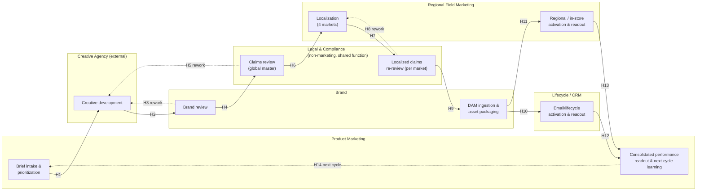

# Current-State Process Map

> Fictional reference scenario authored as an architecture portfolio piece. Not a record of a client engagement.

**Audience:** Marketing operations leadership, cross-functional stakeholders (Brand, Product Marketing, Lifecycle/CRM, Regional Field Marketing, Legal & Compliance, the creative agency).

## Scope

The campaign content lifecycle at Meridian Retail Group (MRG): brief intake → creative development → brand review → legal/claims review → localization (4 markets) → asset packaging into DAM → channel activation (email, web, paid social, in-store) → performance readout → next-cycle learning.

Marketing headcount (~120) sits in five groups: **Product Marketing**, **Brand**, **Lifecycle/CRM**, **Regional Field Marketing**, and the **external creative agency**. Two functions in the diagram below sit outside that headcount but are load-bearing in the process: **Legal & Compliance** (a shared corporate function, not a marketing team) and, implicitly, the agency's own localization subcontractors. Legal & Compliance is drawn as its own lane deliberately — it owns two of the largest queues in the chain (H4→H5 and H6→H8 below), and a process map that hid it to keep the lane count at "5 teams" would misrepresent where the 23 business days `[illustrative]` actually go.

## Swimlane

*Dotted edges (H3, H5, H8, H14) are rework or feedback loops, not forward progress — they are where elapsed time accumulates without new work being done.*

## Handoff register

| ID | From → To | Description | Type |
|---|---|---|---|
| H1 | Product Marketing → Agency | Brief handed off to agency for creative development | Forward |
| H2 | Agency → Brand | Draft creative submitted for brand review | Forward |
| H3 | Brand → Agency | Brand review returns creative for rework | **Rework loop** |
| H4 | Brand → Legal & Compliance | Brand-approved creative submitted for claims review | Forward |
| H5 | Legal & Compliance → Agency | Claims issue found; routed back through creative, not just copy | **Rework loop** |
| H6 | Legal & Compliance → Regional Field Marketing | Globally-approved master asset released for localization | Forward |
| H7 | Regional Field Marketing → Legal & Compliance | Localized copy submitted for per-market claims re-review | Forward |
| H8 | Legal & Compliance → Regional Field Marketing | Localized claims issue found; sent back for re-translation | **Rework loop** |
| H9 | Legal & Compliance → Brand | Locale-cleared variants released for DAM ingestion | Forward |
| H10 | Brand → Lifecycle/CRM | Published asset released to email/lifecycle channel | Forward |
| H11 | Brand → Regional Field Marketing | Published asset released to regional/in-store channel | Forward |
| H12 | Lifecycle/CRM → Product Marketing | Channel performance data delivered for readout | Forward |
| H13 | Regional Field Marketing → Product Marketing | Regional/in-store performance data delivered for readout | Forward |
| H14 | Product Marketing → Product Marketing | Next-cycle learning folded into the next brief | Loop-back |

Fourteen handoffs, three of them rework loops (H3, H5, H8). All three rework loops cross an organizational boundary (Agency↔Brand, Brand↔Legal, Legal↔Regional) rather than staying inside one team — that pattern is the throughline for [D2](02-bottleneck-register.md).

## What this changes

This map is the shared reference every later document points at by handoff ID rather than re-describing the process from scratch. [D2](02-bottleneck-register.md) scores each handoff for automation candidacy against this exact numbering; [D4](04-target-architecture.md)'s target design is only allowed to touch handoffs D2 actually clears. If a future change to the real process moves where legal review sits in the sequence, every downstream document's citations need re-checking against this file first — that is the dependency this map exists to make explicit.
