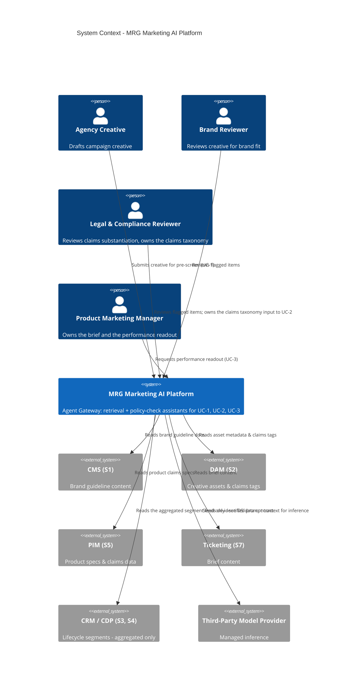
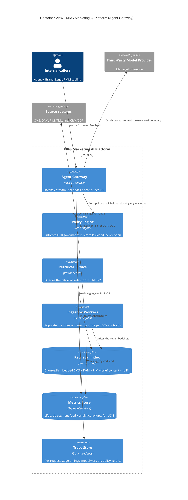
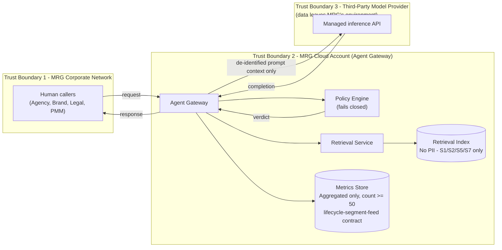
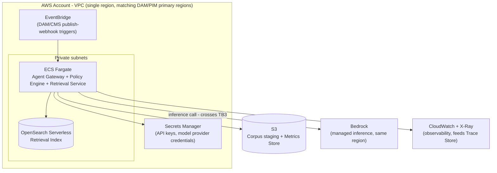

# To-Be AI Architecture

> Fictional reference scenario authored as an architecture portfolio piece. Not a record of a client engagement.

**Audience:** Platform engineering, solution architects, security/governance reviewers.

## Which use cases this architecture serves

[D2](02-bottleneck-register.md) scored seven handoffs High or Medium for automation candidacy. Three become AI use cases here; the other four are deterministic fixes with no model in the loop, designed in [D5](05-data-pipelines.md) instead:

| Use case | Closes | Nature |
|---|---|---|
| **UC-1 — Claims & Brand Pre-Screen Assistant** | B-01, B-03 | Interactive retrieval-augmented check of in-flight creative against brand guidelines and claims-relevant product specs, run during drafting and again before submission |
| **UC-2 — Localization Claims Consistency Checker** | B-02 | Per-market check of localized copy for claims-bearing phrases and back-translation drift against a legal-owned claims taxonomy |
| **UC-3 — Performance Readout Synthesis** | B-07 | Narrative summary generated from pre-aggregated, non-PII lifecycle and analytics rollups |

B-04 (brief intake), B-05 (DAM metadata), and B-06 (activation scheduling) are not AI use cases — a structured form, a metadata template, and a shared calendar solve them respectively. Building a model into a form-validation problem would be over-applying the technology exactly where D2 already flagged the simpler fix as sufficient.

## System context (C4 L1)

## Container view (C4 L2)

## Data flow and trust boundaries

The only PII-relevant crossing in the whole diagram is TB2 → TB3, and by contract nothing that crosses it originates from a PII-flagged source: the retrieval index is built exclusively from S1/S2/S5/S7 (all PII: No or Low per [D3](03-data-landscape.md)), and the metrics store only ever holds aggregates suppressed below a 50-member floor (see D5's `lifecycle-segment-feed` contract). S3 and S4, the two PII-flagged systems, never appear inside TB2 in row-level form — they are pre-aggregated before this boundary, not inside it.

## Deployment view (AWS)

**Cloud posture: AWS.** Not because it's materially better suited to this workload than Azure — it isn't — but because it's where the author's depth actually is, and a deployment diagram that can't survive a follow-up question is worse than none. The Azure equivalence table below exists so "we're a Microsoft shop" costs one paragraph, not a redesign.

This is the same TB1/TB2/TB3 structure as the trust-boundary diagram above: the VPC is TB2, Bedrock is TB3, and the crossing is the same single edge.

### Azure equivalence

| Concern | AWS (as drawn) | Azure equivalent | Notes / where the mapping frays |
|---|---|---|---|
| Compute (gateway) | ECS Fargate | Container Apps | Near-equivalent |
| Managed inference | Bedrock | Azure OpenAI / AI Foundry | Model catalogues differ — this is the real switching cost, not the compute |
| Vector / retrieval | OpenSearch Serverless | AI Search | Hybrid-search semantics differ |
| Object storage | S3 | Blob Storage | Equivalent |
| Secrets | Secrets Manager | Key Vault | Equivalent |
| Eventing | EventBridge | Event Grid | Equivalent in shape, different operational model |
| Observability | CloudWatch + X-Ray | Monitor + App Insights | Equivalent |

The managed-inference row is the one that matters: model catalogue differences, not infrastructure, are what make an AWS-to-Azure move expensive here. That's the same lock-in argument [D8](08-vendor-evaluation.md) makes independently about vendor choice — this table is the infrastructure-level version of it.

## What this changes

D5's ingestion paths and data contracts are scoped to feed exactly the two stores drawn here (the retrieval index and the metrics store) — nothing else. D6's API surface is the only sanctioned way to reach the Policy Engine or Retrieval Service; no consumer talks to the index or metrics store directly. D7's NFR budgets are per-use-case latency budgets for calls that cross this exact diagram, stage for stage. If a future change adds a fourth use case or a new source system, it has to be placed on this diagram — including which trust boundary it sits inside — before D5-D7 are updated to match.
