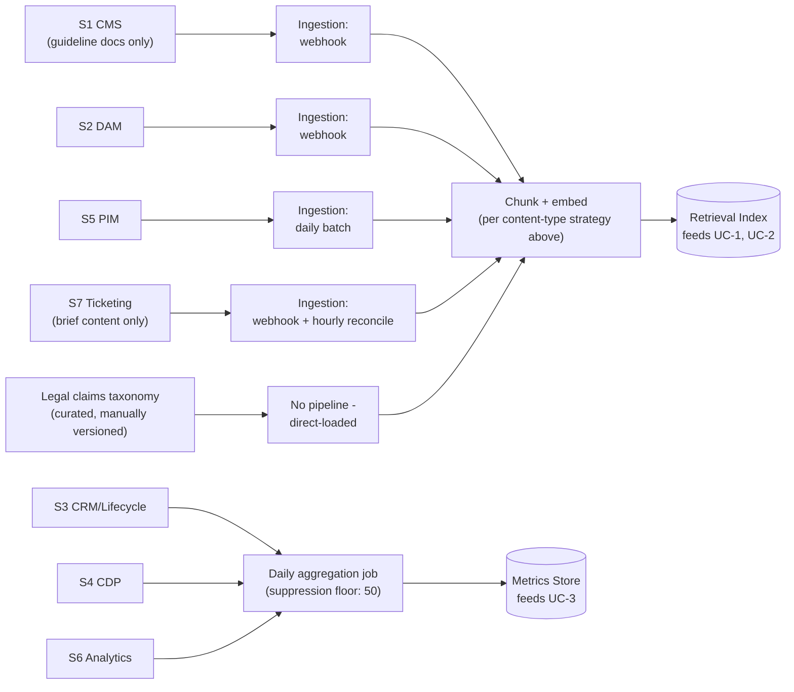

# Data Pipeline & Contract Design

> Fictional reference scenario authored as an architecture portfolio piece. Not a record of a client engagement.

**Audience:** Data engineering teams, platform engineering.

This is the gap-closer document for "collaborate with Data Engineering teams to design data pipelines." It specifies how the two stores drawn in [D4](04-target-architecture.md) — the retrieval index and the metrics store — actually get populated, and it is written to be handed to a data engineering team to build, not to describe code that already exists.

## Sources, and which store each feeds

Of D3's eight systems, four feed the retrieval index (UC-1, UC-2), two feed the metrics store (UC-3) after aggregation, and two feed neither — deliberately, see [Deliberately not pipelined](#deliberately-not-pipelined).

| Source | Feeds | Why |
|---|---|---|
| S1 — CMS | Retrieval index | Brand guideline documents only (not the full CMS corpus — see below) |
| S2 — DAM | Retrieval index | Asset metadata + claims tags |
| S5 — PIM | Retrieval index | Claims-relevant product specs |
| S7 — Ticketing | Retrieval index | Brief content only (not workflow/approval metadata) |
| S3 — CRM/Lifecycle | Metrics store, via aggregation | Never enters the index directly — PII-flagged |
| S4 — CDP | Metrics store, via aggregation | Never enters the index directly — PII-flagged |
| S6 — Analytics | Metrics store, via aggregation | Joins S3/S4's rollup for UC-3 |
| S8 — Agency file share | Neither | No API; see [Deliberately not pipelined](#deliberately-not-pipelined) |

## Ingestion mode per source, and why

CDC exists as an option for every source below; it is deliberately rejected for two of them. A source only gets event-driven or CDC-grade ingestion when its own refresh cadence and reliability actually justify the added operational complexity — matching pipeline sophistication to source behavior, not to what's technically possible.

| Source | Source's own cadence | Chosen ingestion mode | Why |
|---|---|---|---|
| S1 — CMS | Real-time on publish | Event-driven (webhook) | Matches the source's own event model; publish volume is low, so there's no queueing concern to justify batching instead |
| S2 — DAM | Event-driven on ingestion | Event-driven (webhook) | Same reasoning; this event is also what triggers the localization chain downstream, so it has to be event-driven regardless of the retrieval pipeline's own needs |
| S5 — PIM | Daily batch | **Batch, daily — CDC rejected** | The source itself only refreshes daily. CDC would chase a target that only moves once a day; the added infrastructure would buy zero freshness improvement. This is the clearest "don't build what the source doesn't support" case in this document |
| S7 — Ticketing | Real-time webhooks, but used inconsistently (D3) | **Hybrid: webhook-first, hourly batch reconciliation** | The limiting factor is the source's own webhook reliability, not our preference for one mode over another. A pure webhook subscription would silently drop briefs; a pure batch poll would add up to an hour of latency for every brief. The hybrid accepts the batch poll's latency as a bounded worst case rather than an unbounded webhook-drop risk |
| S3/S4 → metrics store | Near-real-time (S3), near-real-time (S4) | Batch, daily | UC-3 is a once-per-cycle synthesis job (see [D7](07-nfr-budgets.md)); real-time ingestion here would add operational cost with no consuming use case fast enough to benefit from it |
| S6 → metrics store | Daily | Batch, daily | Matches S3/S4's cadence into the same daily aggregation job |

## Chunking and embedding strategy, per content type

Chunking granularity is set by query granularity, not by document convenience — a claims check is always about one product or one brief, never a blend of several.

- **Brand guideline docs (S1):** section-based chunking at heading boundaries (~300–500 tokens per chunk), since a guideline section is the coherent unit a claims/brand check actually queries against. Re-embedded on the CMS publish event.
- **DAM asset metadata + claims tags (S2):** not really "chunked" — each asset becomes one small document (description + tags + rights metadata), embedded as a unit. Re-embedded on the DAM ingestion event.
- **PIM claims-relevant specs (S5):** one chunk per product/SKU family. A claims substantiation check is always against a specific product's actual spec — blending two products into one chunk would let the retriever surface the wrong product's certification and have it read as relevant.
- **Brief content (S7):** whole-brief chunking. A brief is short enough that splitting it would separate the claim being made from the context that justifies or constrains it.
- **Per-market legal claims taxonomy:** whole-document chunking, small and curated. See below — this input is not pipelined from a live source at all.

## Data contracts

Two feeds get a full data contract: the ones that are both highest-value (they feed the two most heavily-weighted use cases per [D2](02-bottleneck-register.md)'s cycle-time costs) and highest-risk (one crosses a PII boundary that has to be enforced by the contract itself, not just by policy).

### `dam-asset-feed` — [`specs/data-contracts/dam-asset-feed.yaml`](../specs/data-contracts/dam-asset-feed.yaml)

Feeds the retrieval index for UC-1 and UC-2. Event-driven delivery (DAM publish webhook) with an hourly reconciliation poll as a fallback, since webhooks are at-least-once, not guaranteed. SLA: 5-minute freshness on the happy path, 60-minute worst case via reconciliation; 99.5% monthly availability, capped at the DAM platform's own published SLA — this contract cannot promise better uptime than its source has. Breaking changes require 30 days' notice and a 60-day deprecation window, with a narrow emergency exception for active legal/compliance requirements (e.g. a claims tag must be pulled for regulatory reasons) — logged as an incident regardless.

### `lifecycle-segment-feed` — [`specs/data-contracts/lifecycle-segment-feed.yaml`](../specs/data-contracts/lifecycle-segment-feed.yaml)

Feeds the metrics store for UC-3. This contract's entire purpose is to enforce the aggregation boundary that keeps S3/S4's PII from ever reaching the store: `reachable_count` and every per-segment metric is *omitted* (not zeroed) below a 50-member floor, and `segment_definition_summary` is human-authored at segment creation rather than generated from the underlying query — generating it from the query would risk leaking query logic that could aid re-identification. Unlike the DAM contract, this one has **no emergency exception**: a change touching the PII boundary doesn't get an expedited path even under legal urgency, and requires explicit Legal & Compliance sign-off before it can even be drafted. The asymmetry between these two contracts' change policies is deliberate — it tracks the asymmetry in what's actually at stake if each one breaks.

## Lineage

## Deliberately not pipelined

The low-overhead argument: every source below was considered and excluded, not overlooked.

- **The per-market legal claims taxonomy** is curated and versioned by hand by Legal & Compliance, not synced from a live source. It's small, changes rarely, and carries legal liability — an automated sync would remove the accountable human ownership that's the point of the document existing at all.
- **S7's workflow/approval metadata** (status, SLA timestamps) is not ingested — only brief content is. Workflow state has no retrieval use case behind it; pipelining it would be scope creep with nothing consuming it.
- **S6's raw event-level data** is not ingested at row/event level — only the daily aggregate feeds the metrics store. No use case in this repo needs event-level granularity, and pipelining it "in case something needs it later" would be building ahead of demonstrated need.
- **S8, the agency file share**, is excluded entirely: no API, no webhook, no structured export, and — per D3 — no MRG governance visibility into a third-party vendor's infrastructure. Building a pipeline against a source with an unversioned, unowned input contract means building a pipeline nobody can commit to keeping working. This gap is carried forward to [D9](09-platform-roadmap-ask.md), not solved here by pretending the source is pipeline-ready.
- **S1's non-guideline content** (general web pages, unrelated blog content) is excluded from the retrieval index. Indexing the entire CMS indiscriminately would dilute claims/brand retrieval precision with content no use case queries against.

## What this changes

D6's `invoke` request schema is built to match what these two contracts actually produce: `retrieved_doc_ids` in the API response are `asset_id` values from `dam-asset-feed`, and UC-3's inputs are exactly the fields `lifecycle-segment-feed` defines — no other shape is accepted. If a future source needs to join the retrieval index or metrics store, it has to clear the same CDC-vs-batch reasoning and, if it touches PII, the same contract-level suppression discipline as `lifecycle-segment-feed` — this document is what a proposed new source gets checked against before it's approved to pipeline.
